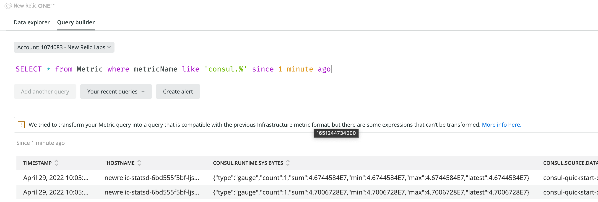

## HCP Consul integration with New Relic example configuration

There are a number of ways and environments in which HCP Consul is installed. In this example we will work with HCP's Quick Start installed via Terraform.

### Generate the Terraform deploy file
Generate the Terraform deployment file from your HCP Portal account's Overview page


### Deploy the Consul cluster
Deploy the Consul cluster following the steps for the appropriate environment in the [End-to-End Overview](https://learn.hashicorp.com/tutorials/cloud/consul-end-to-end-overview)

___VERY IMPORTANT!:___  
&nbsp;&nbsp;&nbsp;&nbsp;&nbsp;&nbsp;&nbsp;&nbsp;Ensure you follow the `Consul CLI configuration` at the bottom of the Deploy page!

### [gostatsd](https://github.com/atlassian/gostatsd) installation
Copy [deploy-gostatsd.yaml](deploy-gostatsd.yaml) and [rbac-gostatsd.yaml](rbac-gostatsd.yaml) to your local Kubernetes client.

#### Edit deploy-gostatsd.yaml
1. Replace `YOUR_NEW_RELIC_ACCOUNT_ID` with your New Relic Account ID
2. Replace `YOUR_NEW_RELIC_LICENSE_KEY` with your New Relic License Key
3. Adjust URLs for EU or FedRAMP accounts if necessary (see comments in file)

#### Deploy gostatsd
```shell
kubectl apply -f deploy-gostatsd.yaml 
kubectl apply -f rbac-gostatsd.yaml 
```

### Configure the Consul clients to report metrics via statsd
#### Edit consul-client-config ConfigMap
Add [Consule telemetry configuration](https://www.consul.io/docs/agent/telemetry) by editing the Consule Client's ConfigMap  
```bash
kubectl edit cm consul-client-config
```  
adding
```yaml
  telemetry-config.json: |-
    {   
      "telemetry": {
        "disable_hostname": false,
        "disable_compat_1.9": true,
        "dogstatsd_addr": "gostatsd.default.svc.cluster.local:8125",
        "dogstatsd_tags": ["consul.source.datacenter:<YOUR_CONSUL_DATACENTER_NAME_HERE>"]
      }   
    }   
```
under `data`. The result should look something like this
```yaml
apiVersion: v1
data:
  central-config.json: |-
    {   
      "enable_central_service_config": true
    }   
  config.json: |-
    {   
      "check_update_interval": "0s"
    }   
  extra-from-values.json: '{}'
  telemetry-config.json: |-
    {   
      "telemetry": {
        "disable_hostname": false,
        "disable_compat_1.9": true,
        "dogstatsd_addr": "gostatsd.default.svc.cluster.local:8125",
        "dogstatsd_tags": ["consul.source.datacenter:<YOUR_CONSUL_DATACENTER_NAME_HERE>"]
      }   
    }   
```

##### Notes
1. We use the `dogstatsd_addr` here so we can add the `consul.source.datacenter:` tag to each metric. This allows the New Relic ONE dashboards to facet by Consul Datacenter.
2. Be sure to replace `<YOUR_CONSUL_DATACENTER_NAME_HERE>` with your Consul Datacenter name.
3. [Consul telemetry configuration options](https://www.consul.io/docs/agent/config/config-files#telemetry)

#### Edit consul-connect-injector Deployment
Enable Consul metrics in the deployment by editing the deployment  
```bash
kubectl edit deploy consul-connect-injector
```
Search for `default-enable-metrics` and set it to `true`  
```yaml
            -default-enable-metrics=true  \
```

#### Restart Consul client pods
The Consul Client's may, or may not, restart after the configuration changes. If they do not, restart each Consul client pod
```bash
kubectl delete pod consul-client-<POD_ID> -n <NAMESPACE>
```

### Browse Consul metrics in New Relic ONE

Naviagate to the New Relic ONE data browser


Query the captured Consul metrics



### Trouble shooting
1. For a pod that crashes at init

       kubectl logs PODNAME -c consul-connect-inject-init
2. For a running pod:

       kubectl logs PODNAME -c DEPLOYMENTNAME

### Useful kubectl snippets
1. Delete all pods

       kubectl get pods | grep PODNAMEPREFIX | cut -f 1 -d ' ' | xargs kubectl delete pods

2. Delete a deployment and pods generated by it

       kubectl delete deployment DEPLOYMENTNAME -n default
