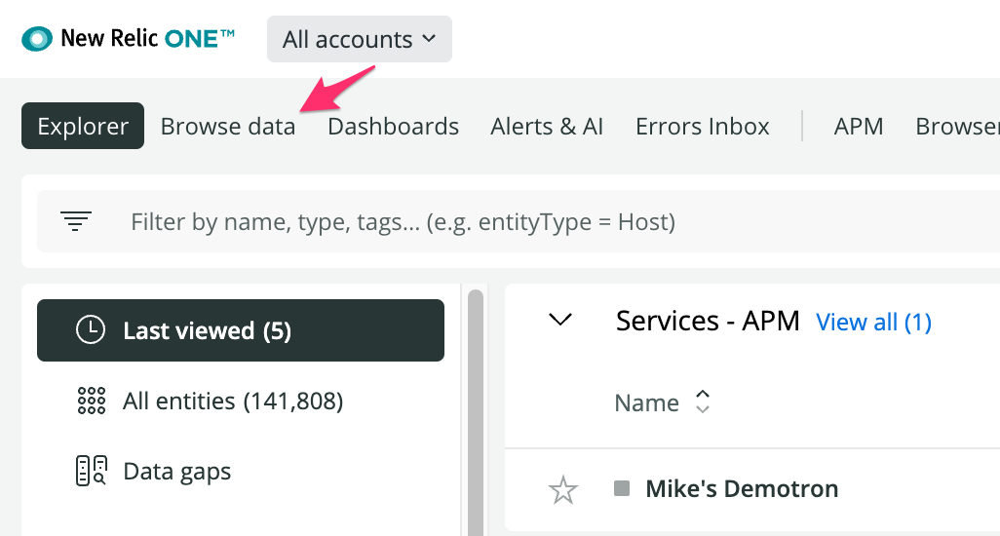
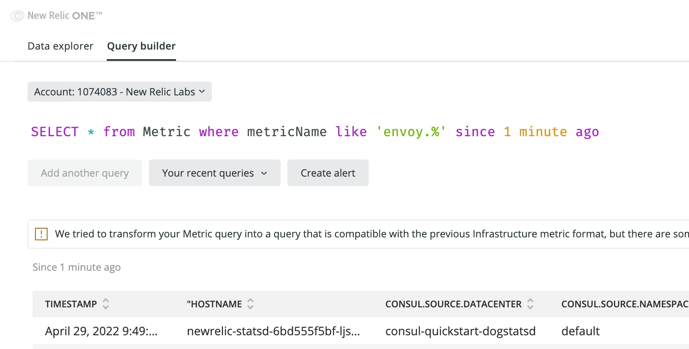

## HCP Envoy integration with New Relic example configuration

HCP Envoy is embedded in HCP Consul, as such there are a number of ways and environments in which it is installed. In this example we will work with HCP's Quick Start installed via Terraform.

### Generate the Terraform install file
Generate the Terraform installation file from your HCP Portal account's Overview page


### Add Envoy statsd configuration to the generated Terraform file

Edit the generated Terraform file:
- add `scheme = "https"` to the `provider "consul"` section
- add a `resource "consul_config_entry" "proxy_defaults"` block to [configure Envoy telemetry](https://www.consul.io/docs/connect/proxies/envoy#bootstrap-configuration)

The result should look like this: 

```json
provider "consul" {

  address    = hcp_consul_cluster.main.consul_public_endpoint_url
  token      = hcp_consul_cluster_root_token.token.secret_id
  datacenter = hcp_consul_cluster.main.datacenter
  scheme     = "https"
}

resource "consul_config_entry" "proxy_defaults" {
  kind = "proxy-defaults"
  name = "global"

  config_json = jsonencode({
    Config = { 
      envoy_statsd_url = "udp://127.0.0.1:8125"
    }   
  })  
}


```

### Create the Consul cluster
Create the Consul cluster following the steps for the appropriate environment in the [End-to-End Overview](https://learn.hashicorp.com/tutorials/cloud/consul-end-to-end-overview)

### [Install New Relic Statsd monitoring integration](https://docs.newrelic.com/docs/infrastructure/host-integrations/host-integrations-list/statsd-monitoring-integration-version-2)

### Browse Envoy metrics in New Relic ONE

Naviagate to the New Relic ONE data browser



Query the captured Envoy metrics


